<p align="center">
  
</p>

<h1 align="center">telegram-harness</h1>

<p align="center">
  <b>Tus agentes de programación, gestionados desde Telegram.</b><br>
  Los agentes de Claude Code planifican, implementan, prueban, despliegan y verifican. Un gestor los mantiene en marcha<br>
  y solo te pregunta lo que te toca decidir a ti.
</p>

<p align="center">
  <a href="https://github.com/nhype/telegram-harness/actions/workflows/ci.yml"></a>
  <a href="LICENSE"></a>
  
</p>

<p align="center">
  <a href="#inicio-rápido">Inicio rápido</a> ·
  <a href="#comparación-con-alternativas">Comparación</a> ·
  <a href="docs/architecture.md">Arquitectura</a>
</p>

<p align="center"><sub>
  <a href="README.md">English</a> ·
  <a href="README.ru.md">Русский</a> ·
  <b>Español</b> ·
  <a href="README.zh-CN.md">简体中文</a> ·
  <a href="README.de.md">Deutsch</a> ·
  <a href="README.it.md">Italiano</a>
</sub></p>

<p align="center">
  <picture>
    <source media="(prefers-color-scheme: dark)" srcset="docs/assets/demo-dark.svg">
    <source media="(prefers-color-scheme: light)" srcset="docs/assets/demo-light.svg">
    
  </picture>
</p>

**Ejecuta agentes de Claude Code desde Telegram.** Le escribes una tarea a tu bot; Hermes Agent lanza un
agente de Claude Code en un panel de terminal de Herdr, lo guía por el ciclo de vida de OpenSpec (plan →
código → pruebas → despliegue → archivado) y solo te escribe cuando necesita una decisión o tiene un resultado.

```
 tú ── Telegram ──▶ Hermes Agent (gateway del host) ──▶ tu perfil
                       │  chat: recibe tareas, responde a "¿cómo va?"    skill: harness-delivery
                       │  ruta webhook ◀── eventos ── bridge ◀── servidor Herdr (estado de paneles)
                       │  una ejecución del controller por evento        skill: harness-controller
                       ▼
                    paneles de Herdr: agentes de Claude Code trabajando en tu repo (OpenSpec + lean-ctx)
```

- **Herdr** ejecuta los agentes en paneles de terminal y notifica cada cambio de estado (trabajando /
  inactivo / terminado).
- **El bridge** (`harness/scripts/herdr_event_bridge.py`) agrupa esos eventos con debounce y despierta una
  sola ejecución del controller por tarea a la vez; un watchdog vuelve a despertarlo cuando una tarea se
  atasca o termina una espera.
- **Hermes Agent** hace de gestor: la parte del chat inicia las tareas; la parte del controller lee el
  panel, decide el siguiente paso y le da instrucciones al agente. Resuelve por su cuenta las cuestiones
  técnicas y solo te consulta sobre dinero, acciones irreversibles, decisiones de producto y tus propias
  cuentas.
- **OpenSpec** da a cada tarea un plan, una lista de verificación y un registro archivado; **lean-ctx**
  mantiene reducido el contexto de los agentes.

## Por qué telegram-harness

La mayoría de las herramientas te permiten *chatear* con un agente de programación desde el teléfono, pero
aun así tienes que estar pendiente de él. telegram-harness te da un **gestor**: dices lo que quieres y él
se encarga de que el cambio quede desarrollado, probado, desplegado, verificado y fusionado. Solo te
escribe cuando de verdad te necesita.

- **Un gestor, no un simple intermediario.** Entre un mensaje tuyo y el siguiente, un controller lee la
  pantalla del agente después de cada paso y lo mantiene en marcha. Responde las preguntas técnicas a
  partir del repositorio y de tus decisiones anteriores, elige opciones de menú según tu política y se
  recupera de errores de la API y de contextos llenos.
- **Todo el ciclo de vida, hasta producción.** Plan de OpenSpec → código → pruebas → despliegue → smoke
  test en vivo → archivado → fusión en `main`. "Hecho" significa *en producción y verificado*, no "código
  escrito".
- **Solo te pregunta lo que te toca decidir a ti:** dinero, acciones irreversibles, decisiones de
  producto, tus cuentas. Todo lo demás lo decide él y te informa. Un simple "sí" en el chat le llega al
  agente que preguntó.
- **Nunca se queda atascado en silencio.** Un watchdog basado en eventos detecta atascos, esperas
  vencidas y paneles colgados. Si aun así una tarea no avanza, el propio bridge te escribe, incluso
  cuando Hermes está caído.
- **Un segundo par de ojos.** Un agente revisor independiente examina el plan y el diff en busca de
  riesgos económicos, de privacidad, de seguridad, de pérdida de datos y de concurrencia antes de que
  nada salga a producción.
- **Tu servidor, tu suscripción.** El código y la producción nunca salen de tu máquina, y los agentes
  funcionan con tu propio plan de Claude. Sin facturas SaaS por tarea ni VM de un proveedor. Licencia MIT.
- **Observa o toma el control en cualquier momento.** Cada agente vive en un panel de terminal de Herdr
  que puedes abrir, leer y en el que puedes escribir.
- **Contexto ligero.** lean-ctx comprime lo que leen los agentes, así que las tareas largas caben en el
  contexto y cuestan menos.
- **Nacido del uso real.** Extraído de un entorno que lleva cambios a producción todos los días. Tiene
  más de 320 pruebas, CI y una prueba de integración contra un Hermes real en un contenedor limpio.

## Comparación con alternativas

| | **telegram-harness** | Bots de Telegram para Claude Code¹ | Clientes móviles² | Orquestadores locales³ | Agentes de programación en la nube⁴ |
|---|---|---|---|---|---|
| Dónde se ejecutan los agentes | tu servidor | tu servidor | tu equipo | tu equipo | nube del proveedor |
| Cómo los manejas | Telegram, en lenguaje natural | chat de Telegram con una sesión | app del teléfono / web | TUI de escritorio o tablero | web, IDE, Slack, GitHub |
| Quién mantiene al agente en marcha entre tus mensajes | **el controller** | tú | tú | tú | el agente del proveedor |
| Plan → código → despliegue → verificación en vivo → fusión, ya integrado | **sí** | no | no | no, revisas y fusionas tú | suele terminar en una pull request |
| Agente revisor independiente | **sí** | no | no | no | depende |
| Detección y aviso de tareas atascadas | **sí** | no | notificaciones | no | depende |
| Te interrumpe solo para decisiones reales | **sí** | con cada pregunta | con cada pregunta | con cada pregunta | depende |
| Despliega en *tu propia* producción | **sí** | a mano | a mano | a mano | rara vez |
| Costo | tu plan de Claude + un LLM para Hermes | tu plan | tu plan | tu plan | por puesto o por uso |
| Licencia | MIT | mayormente de código abierto | código abierto | código abierto | propietaria |

¹ p. ej., claude-code-telegram, CCBot, Claude Telegram Bot Bridge. ² p. ej., Happy, Omnara.
³ p. ej., Claude Squad, Vibe Kanban. ⁴ p. ej., Codex cloud, los agentes en segundo plano de Cursor, GitHub Copilot coding agent, Devin.
Las columnas describen la configuración típica de cada categoría a octubre de 2026. Cada proyecto
cambia rápido, así que consulta su documentación.

**Cuándo conviene otra opción:**
- quieres programar en pareja en vivo desde el teléfono, línea por línea (un cliente móvil es más sencillo);
- no tienes un servidor Linux, o necesitas macOS o Docker (todavía no se admiten);
- tu equipo necesita un chat compartido multiusuario (telegram-harness está pensado para un solo propietario por bot).

## Requisitos

- Un servidor Linux con systemd (lo ideal es una VM o un usuario dedicados: los agentes se ejecutan con
  `--dangerously-skip-permissions`).
- Un token de bot de Telegram de [@BotFather](https://t.me/BotFather) y tu ID numérico de usuario
  (pídeselo a [@userinfobot](https://t.me/userinfobot)).
- Una suscripción a Claude o una clave de API para Claude Code.
- Un proveedor de LLM para Hermes (OpenRouter, Anthropic, OpenAI, Nous Portal, …).
- python3 ≥ 3.11, git, curl; Node.js ≥ 20 + npm (para OpenSpec); `libatomic1` (las imágenes mínimas de
  Ubuntu no la incluyen: `sudo apt-get install -y libatomic1`).

## Inicio rápido

```bash
git clone https://github.com/nhype/telegram-harness
cd telegram-harness
./install.sh
```

El instalador te pide el nombre del proyecto, la ruta del repositorio, tu ID de Telegram y el token del
bot (sin mostrarlo en pantalla), instala lo que falte (Herdr, Hermes Agent, Claude Code, OpenSpec y
lean-ctx, con sus instaladores oficiales), configura un perfil de Hermes para el proyecto e inicia los
servicios. Después:

```bash
claude                      # inicia sesión en Claude Code (solo una vez)
hermes -p <perfil> model    # elige el modelo que usará Hermes
bin/harness doctor <perfil>
```

y envía `/start` a tu bot. Deja el clon donde está: los scripts y plugins del perfil son enlaces hacia
él. Instalación no interactiva (el token se lee sin que quede en el historial de tu shell):

```bash
read -rs TELEGRAM_BOT_TOKEN && export TELEGRAM_BOT_TOKEN
./install.sh --yes --project Acme --repo /srv/acme --owner-id 123456789
```

Usa un token de bot propio para cada proyecto: dos perfiles de Hermes no pueden compartir el mismo bot.

Ejecuta `./install.sh --help` para ver todas las opciones (`--dry-run` muestra el plan sin cambiar nada).

## Uso diario

Escríbele al bot como a un compañero de trabajo:

- *"Añade exportación a CSV en la página de informes"* → el bot lanza un agente que redacta una propuesta
  de OpenSpec y luego la implementa, la prueba, la despliega y la archiva; cuando el cambio está en
  producción, recibes un mensaje breve.
- *"¿cómo va?"* → qué está hecho, qué falta, si los agentes trabajan o esperan y qué se necesita de ti.
- Cuando el bot pregunta algo (pocas veces), responde con naturalidad: *"sí"*, *"2"*, *"adelante"*; la
  respuesta le llega al agente que preguntó.

Explícale al controller cómo se despliega tu proyecto y cómo hacerle un smoke test: edita la sección
**Project notes** al final de `~/.hermes/profiles/<perfil>/skills/harness-controller/SKILL.md`. El
instalador nunca sobrescribe ese archivo una vez que lo has editado.

## Actualización

```bash
git pull
./install.sh --profile <perfil>   # reutiliza tus respuestas guardadas; puedes volver a ejecutarlo sin riesgo
```

## Desinstalación

```bash
bin/harness uninstall-services <perfil>   # bridge + ruta webhook; el gateway compartido de Hermes se mantiene
hermes profile delete <perfil>            # opcional: el perfil y su historial
```

## Componentes

| Componente | Función | Versión probada | Licencia |
|---|---|---|---|
| [Herdr](https://herdr.dev) | espacio de trabajo en terminal para agentes, eventos de estado | 0.8.0 | Apache-2.0 |
| [Hermes Agent](https://github.com/NousResearch/hermes-agent) | gateway de Telegram, ejecuciones del chat y del controller | 0.21.5 (d795726f) | MIT |
| [Claude Code](https://docs.claude.com/en/docs/claude-code) | el agente de programación | 2.1.288 | comercial |
| [OpenSpec](https://github.com/Fission-AI/OpenSpec) | flujo de cambios guiado por especificaciones | 1.13.1 | MIT |
| [lean-ctx](https://github.com/yvgude/lean-ctx) | compresión de contexto para agentes | 3.10.2 | Apache-2.0 |

El harness en sí lo forman el bridge, el registro de tareas, el script de la ruta, tres plugins de
Hermes, dos skills y el instalador. Los plugins parchean algunas partes internas del gateway de Hermes,
así que con una versión de Hermes mucho más reciente puede que haya que actualizar el harness; después
de `hermes update`, ejecuta `bin/harness test-plugins` (las pruebas de los plugins, dentro del propio
runtime de Hermes).

## Documentación (en inglés)

- [Architecture](docs/architecture.md) — componentes, flujo de eventos, esperas y nuevas comprobaciones
- [Configuration](docs/configuration.md) — `herdr-pipeline.json`, ajustes del perfil, Project notes
- [Manual install](docs/manual-install.md) — los pasos del instalador como comandos
- [Security](docs/security.md)
- [Troubleshooting](docs/troubleshooting.md)

## Licencia

[MIT](LICENSE)
